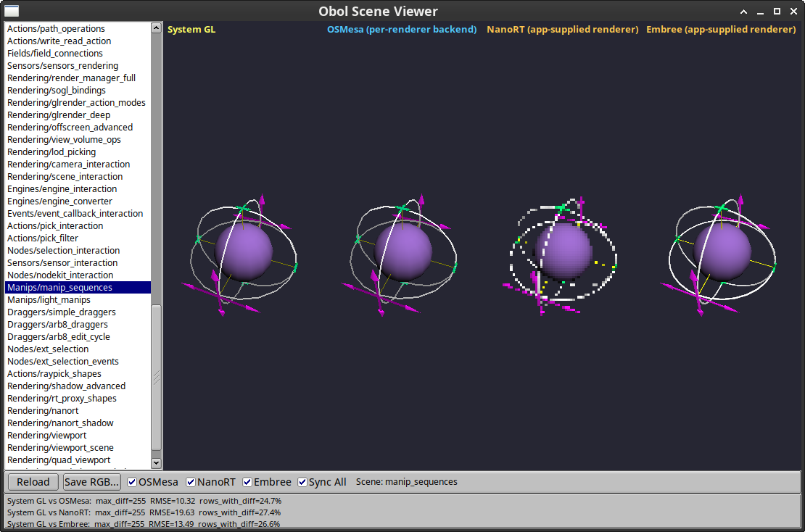
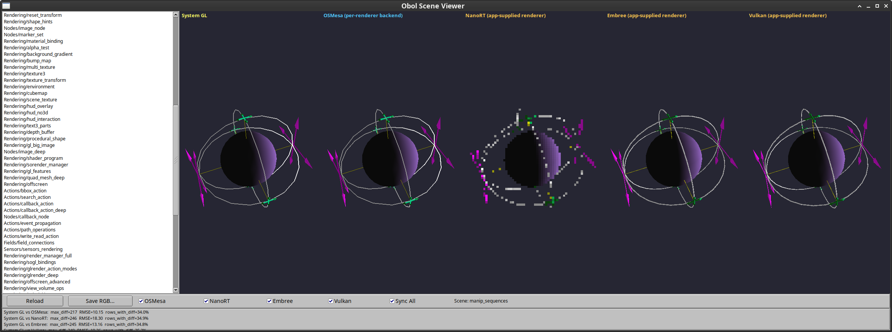

# Obol - minimalist rework of Coin

## Introduction

Obol is a 3D graphics library intended to support easy definition of and
interaction with geometric scenes.  It largely implements the Open Inventor
2.1 API, but does not maintin strict compatibility - see docs/API_DIFFERENCES.md
for more details.

Major design philosophies include broad cross platform compatibility and minimal
external dependencies.  Most modern toolkits provide their own means
of integrating with system OpenGL contexts or other means of 3D display
visualization - Obol accordingly provides an API to allow the application
to specify how to use their display mechanisms and works within that framework.
There are multiple worked examples in the examples/ directory.

## Requirements

Obol needs a C++17 compiler.  Further requirements depend on what backends
the user is interested in - typically, you'll want a system OpenGL available
for the best combination of features and performance.  The libosmesa backend
provides a software-only OpenGL 2.0 + extensions stack that can support most
of what Obol needs, but it will be slower.  Integration with other backends
is also possible - see the examples for raytracing and Vulkan based
approaches.

## Why call this Obol?

The name Obol refers to an ancient small-denomination Greek coin worth one
sixth of a drachma — a play on the name of the upstream [Coin](https://github.com/coin3d/coin)
project that Obol was originally derived from.  Obol has a much smaller
scope than Coin, and it's primary OpenGL code is fixed function pipeline based,
so a small, ancient coin seemed like a good fit.

## Documentation

* `docs/API_DIFFERENCES.md` — comprehensive API migration guide (Obol vs. Coin)
* `docs/BUILD_OPTIONS.md` — CMake build options reference
* `docs/CONTEXT_MANAGEMENT_API.md` — `SoDB::ContextManager` API reference with worked examples
* `docs/TESTING.md` — test suite overview and how to write new tests
* `docs/COIN_MIGRATION_PLAN.md` — modernization status and completed work log
* `docs/THREADING_MIGRATION.md` — C++17 threading migration details
* `docs/STORAGE_MIGRATION.md` — thread-local storage migration analysis and status
* `docs/PLATFORM_CLEANUP_SUMMARY.md` — platform-specific code removal summary

## License and trademarks

Most Obol code is from Coin, and maintains its copyright and license:

BSD License (c) Kongsberg Oil & Gas Technologies AS

Contributions by the Obol project are under the same terms and license as
Coin.  Embedded code from other sources has its own licenses, but we do not
include any code incompatible with the BSD license in core Obol.  The Mentor
example files are LGPL.

TODO - list other code copyright and license terms in doc/LICENSES.md

OpenGL and Open Inventor are trademarks of SGI Inc.

